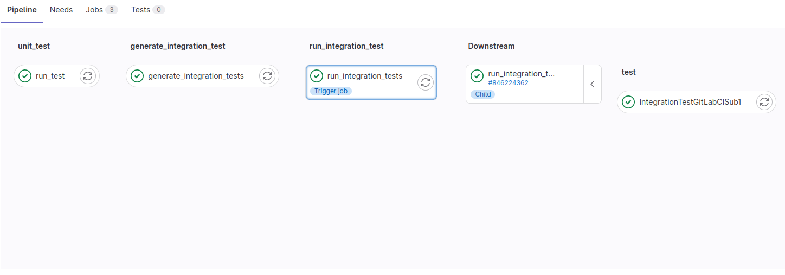
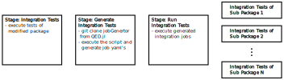

# Automatic Testing

In the `QED.jl` eco-system, we use [Continuous integration](https://en.wikipedia.org/wiki/Continuous_integration) (CIs) for running automatic tests. Each time, if a pull request is opened or a change is committed to an open pull request, the CI pipeline is triggered and starts a test script. The result of the tests will be reported in the pull request. In `QED.jl`, we distinguish between two kinds of tests

- **Unit tests**: tests which check the functionality of the modified (sub) package. Those tests can either run standalone or use the functionality of other (third-party) packages. 
- **Integration tests**: tests which check the interoperatebility of the modified package with all sub-packages. For example, if package `A` is dependent on package `B` and you change package `B`, the integration test will check, if package `A` still works with the new version of package `B`.

The CI will first execute the unit tests. Then, if all unit tests are passed, the integration tests will be started. 

Our CI uses the [GitLab CI](https://docs.gitlab.com/ee/ci/) because it allows us to use CI resources provided by [HIFIS](https://www.hifis.net/), where we can strong CPU runners and special runners, like Nvidia and AMD GPUs.


# Unit Test for CI Users

The unit tests are automatically triggered, if you open a pull request, which target the `main` or `dev` branch. Before the tests start, the CI setup the test environment. Therefore it takes the `Project.toml` of a project and add the latest development version of each QED dependency. Other dependencies will be regular resolved by the Julia Package manager. Afterwards the unit tests will be executed.

You can also modify, which version of a QED dependency should be used. For example you need to test your code with a function, which is not merged in the development branch yet. Therefore you need to add specific line to your commit message with the following format:

```
CI_UNIT_PKG_URL_<dep_name>: https://github.com/<user>/<dep_name>#<commit_hash>
```

You find the `<dep_name>` name in the `Project.toml` of the dependent project. For an example let's assume the name of the dependent package is `depLibrary`. The url of the fork is https://github.com/user/depLibrary.jl and the required feature has the commit sha `45a753b`.

```
This commit extends function foo with a new
function argument.

The function argument is required to control
the new functionality.

If you pass a 0, it has a special meaning.

CI_UNIT_PKG_URL_depLibrary: https://github.com/user/depLibrary.jl#45a753b
```

It is also possible to set a custom URL for more than one package. Simple add an additional line with the shape of `CI_UNIT_PKG_URL_<dep_name>: https://github.com/<user>/<dep_name>#<commit_hash>` to the commit message.

!!! note

    You don't need to add a new commit to set custom URLs. You can modify the commit message with `git commit --amend` and force push to the branch. This also starts the CI pipeline again.


# Integration Test for CI Users

The integration tests are automatically triggered, if you open a pull request, which target the `main` or `dev` branch, and the unit tests passed. The integration tests itself are in an extra stage of the CI. 



If the tests pass successfully, you don't need to do something. If the fails, i.e. the change breaks the interoperation with another package in the eco-system, the pull request will suspend, and one has two options to proceed:

1. One can solve the problem locally, by changing the code of the modified (sub) package. The workflow is the same, like fixing unit tests.
2. One need to modify the depending package, which failed in the integration test. In the following, we describe how to provide the necessary changes to the downstream package and makes the CI pass the integration tests, which will resume the pull request. 

For better understanding, the package currently modified by the pull request is called `orig`, and the package, which depends on it is referred to as `dep`.  First, one should fork the package `dep` and checkout a new feature branch on this fork. The fix of the integration issue for `dep` is now developed on the feature branch. Once finished, the changes to `dep` are push to GitHub, and pull request on `dep` is opend to check in the changes. By default, the unit test for `dep` should fail, because the CI in `dep` needs to use the modified version of `orig`. The solution for this problem is explained in the section [Unit Test for CI Users](#Unit-Test-for-CI-Users). Using this, one should develop the fix on the feature branch until the CI of `dep` passes all unit tests. In this case, original pull request in the upstream package `orig` can be resumed. Therefore, one needs to tell the CI of `orig` that the integration tests should use fixed version package `dep`, which is still on the feature branch in a pull request on `dep`. In order to proceed, the CI on `orig` needs the information, where the fix for `dep` is lying. This is given to the CI of `orig` in a commit message on the origin branch of the pull request on `orig`, one just needs to add a new line with the following format to the commit message: 

```
CI_INTG_PKG_URL_<dep_name>: https://github.com/<user>/<dep_name>#<commit_hash>
```

You find the names of the environment variables in the dict `package_infos` in the [jobGenerator/src/jobGenerator.jl](https://github.com/SimeonEhrig/GitlabCIMain/blob/master/jobGenerator/src/jobGenerator.jl). For an example let's assume the name of the `dep` package is `dep1.jl`, `user1` forked the package and the commit hash of the fix for package `dep1.jl` is `45a723b`. Then, an example message could look like this:

```
This commit extends function foo with a new
function argument.

The function argument is required to control
the new functionality.

If you pass a 0, it has a special meaning.

CI_INTG_PKG_URL_DEP1JL: https://github.com/user1/dep1.jl#45a723b
```

It is also possible to set a custom URL for more than one package, which depends on `orig`. Simple add an additional line with the shape of `CI_INTG_PKG_URL_<dep_name>: https://github.com/<user>/<dep_name>#<commit_hash>` to the commit message.

!!! note

    You don't need to add a new commit to set custom URLs. You can modify the commit message with `git commit --amend` and force push to the branch. This also starts the CI pipeline again.


# Integration Test for CI Develops

This section explains how the integration tests are created and executed. It is not mandatory to read the section if you only want to use the CI. The following figure shows the stages of the CI pipeline:



All of the following stages are executed in the CI pipeline of the sub-package, where the code is modified. This means also, that GitLab CI automatically checks out the repository with the changes of the pull request and provides it in the CI job. We name the package `orig` for easier understanding of the documentation.

- **Stage: Integration Tests**: Execute the unit tests of `orig` via `Pkg.test()`.
- **Stage: Generate integration Tests**: Download the `jobGenerator.jl` script from the `QED.jl` package via `git clone`. The script is executed with the name of the subpackage `orig`. The script traverses the dependency tree of the `QED.jl` and it is searching for sub-packages which has a dependency of package `orig`. For each package with the dependency of package `orig`, the generator generates a job yaml. By default, it uses the upstream repository and development branch of the package tested in the integration test. The repository and commit can be changed via the environment parameter in the git commit message. The `jobGenerator.jl` uses the `Package.toml` of the `QED.jl` package because all sub-packages are direct and indirect dependencies of it.
- **Stage: Run Integration Tests**: This stage uses the generated job yaml to create and run new test jobs. It uses the [GitLab CI child pipeline](https://about.gitlab.com/blog/2020/04/24/parent-child-pipelines/#dynamically-generating-pipelines) mechanism.
- **Stage: Integration Tests of Sub package N**: Each job clones the repository of the subpackage. After the clone, it uses the Julia function `Pkg.develop(path="$CI_package_DIR")` to replace the dependency to the package `orig` with the modified version of the Pull Request and execute the tests of the subpackage via `Pkg.test()`.

!!! note

    If a sub package triggers an integration test, the main package `QED.jl` is passive. It does not get any notification or trigger any script. The repository is simply cloned.

